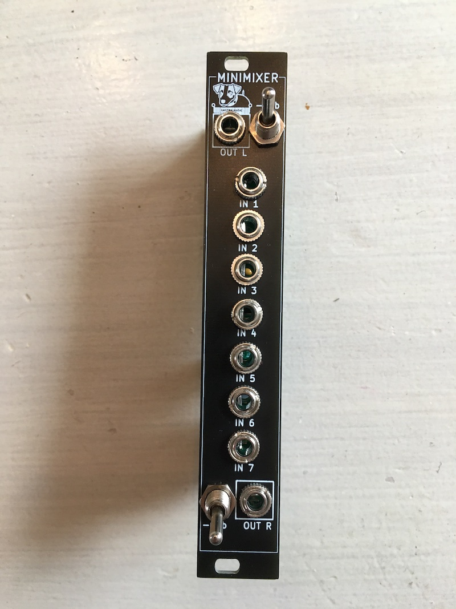
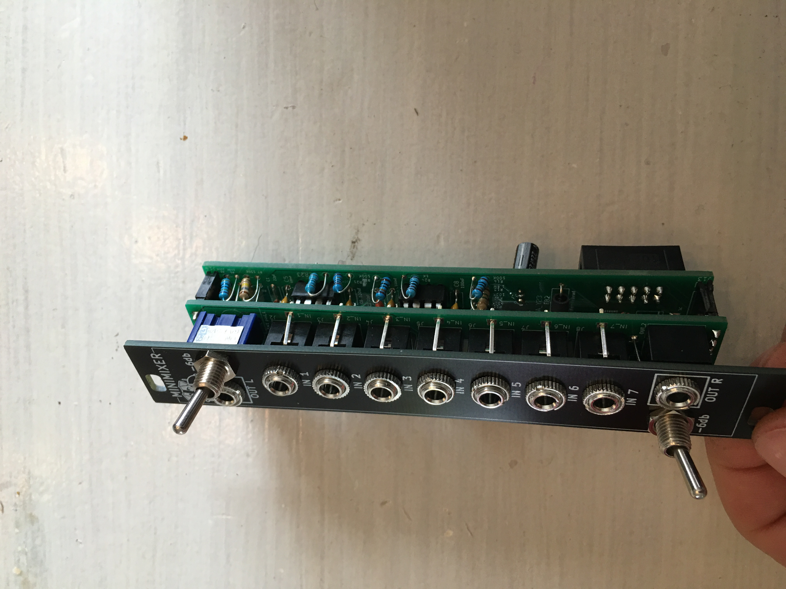

# MiniMixer eurorack
 MiniMixer Eurorack
Modiffication du module [μSt](https://www.olivellamodular.com/ust.html) de Olivella Modular.
Nouveau Front Panel, utilisation des empreintes thonkiconn jack, modification des valeurs de résistances pour avoir une courbe panoramique plus linéaire, et surtout des valeurs plus facile à trouver.
Le module a été testé, il fonctionne parfaitement.

[Build document](https://htmlpreview.github.io/?https://github.com/jojo-monk/MiniMixer-eurorack/blob/main/ibom.html)

Based on Nearness, by Jesper Särnesjö. Through-hole remix by Kevin Olivella.
